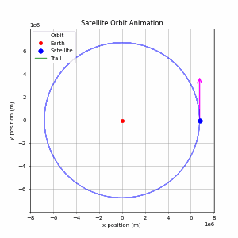

# 2D_Orbital_Sim
Python-based orbital mechanics simulation utilizing RK4 numerical methods and atmospheric drag models to visualize satellite dynamics and orbital decay.

# GIF

# Physics & Technical Features
- High-Precision ODE Solving: The simulation uses scipy.integrate.solve_ivp, specifically the RK45 (adaptive Runge-Kutta) solvers. With a relative tolerance set to 1e-8, the model maintains the high precision required for long-term stability analysis.
- Non-linear Atmospheric Drag: Unlike simple vacuum models, this simulation uses a realistic exponential density model to simulate orbital decay in Low Earth Orbit (LEO).
  - Density Formula: $\rho = \rho_0 e^{-h/H}$ where $\rho_0 = 1.225 \ \text{kg/m}^3$ and $H = 8500 \ \text{m}$.
  - Drag Acceleration: $\mathbf{a}_{drag} = -\frac{1}{2m} C_d \rho A v^2 \hat{\mathbf{v}}$.
- Gravitational Modeling: Acceleration is calculated using Newton's Law of Universal Gravitation: $$\mathbf{a} = -\frac{G M_{earth}}{r^3} \mathbf{r}$$
  - Where $G = 6.6743 \times 10^{-11} \ \text{m}^3\text{kg}^{-1}\text{s}^{-2}$ and $M_{earth} = 5.972 \times 10^{24} \ \text{kg}$.
- Vector Visualization: Also uses real-time rendering of velocity vectors to show the conservation of angular momentum.

# Instructions to Run
- Uses the libraries: Numpy, Matplotlib, & Scipy
- Clone the repository and run python ObitSim.py.
- The script will prompt you for an initial altitude (km) and initial velocity (m/s).
- If no input is provided, then the code will default to a standard circular orbit at 400 km.

# Outputs
- Initial Conditions: Altitude and velocity.
- Orbital Metrics: Estimated orbital period (minutes) and time-series crossing indices.
- Visual Data: A 2D plot showing the satellite's path, Earth's radius, and dynamic velocity arrows.
